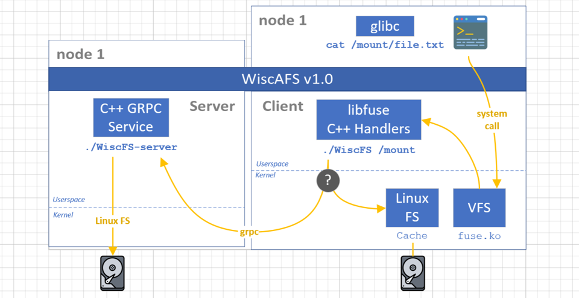

# WiscFS [cs739-p1-distributed-fs]

AFS-like Distributed FS project based on <https://github.com/ligurio/unreliablefs>. AFSv1: whole-file caching on local client machine.

- OSTEP book: AFSv1 Protocol Highlights (Early version: caches only files, while directories are kept on the server) - check protobuf interface.
  - Update visibility; Cache staleness
  - Provide consistency between processes on different machines
  - AFS semantics: Last writer/closer winds approach for race conditions
  
- [P1 Instructions](documentation/CS739.P1.md)
- build (adding AFS protocol based on RPC) on top of an existing FUSE filesystem [unreliablefs](https://github.com/ligurio/unreliablefs)
- CloudLabs Ubuntu 20.04

# Setup

- execute `./script/provision.sh` to setup repo and install dependencies
- run script `build.sh` will result in binary files in `./target/release`
- run individual commands (copy & paste) in `run.sh`
- run tests: filebench and consistency setups.

NOTE: run funcitons in script files using: `. ./script/<scriptname>.sh && <functioname>`

- Compiler optimizations <https://waterprogramming.wordpress.com/2017/10/29/simple-tricks-to-make-your-cc-code-ran-faster/>

# FUSE resources:

- [ ] official specification <https://libfuse.github.io/doxygen/index.html>
  - [ ] <https://github.com/libfuse/libfuse/blob/master/include/fuse.h>
- [ ] FUSE alternative doc <https://www.fsl.cs.stonybrook.edu/docs/fuse/fuse-article-appendices.html>
- [ ] <https://manpages.ubuntu.com/manpages/bionic/man4/fuse.4.html>
- [x] <https://fsgeek.ca/2019/06/18/fuse-file-systems-in-user-space/>
- [ ] \*\* <https://wiki.osdev.org/FUSE>
- [ ] <https://man7.org/linux/man-pages/man4/fuse.4.html>
- [x] <https://www.cs.nmsu.edu/~pfeiffer/fuse-tutorial/>
  - [ ] documentation & tutorial <https://www.cs.nmsu.edu/~pfeiffer/fuse-tutorial/html/index.html>
- [x] <https://medium.com/@jain.sm/filesystem-in-userspace-5d1b398b04e>
  - [ ] <https://medium.com/@jain.sm/file-system-in-user-space-example-a63a21236270>
  - [ ] <https://github.com/JulesWang/helloworld-fuse>
- [x] <https://www.cs.cmu.edu/~fp/courses/15213-s07/lectures/15-filesys/index.html>
- [ ] <https://stackoverflow.com/questions/15604191/fuse-detailed-documentation>
- [x] FUSE Documentation <https://www.cs.hmc.edu/~geoff/classes/hmc.cs135.201109/homework/fuse/fuse_doc.html>
- [ ] Fuse Tutorial <https://www.youtube.com/watch?v=LZCILvr5tUk>
- [ ] Fuse info <https://northstar-www.dartmouth.edu/~richard/WhitePapers/FUSE.html#:~:text=The%20FUSE%20device%20driver%20is,via%20a%20well%20defined%20API.>
- [ ] cpp example FUSE <https://code.google.com/archive/p/fuse-examplefs/source/default/source>
- [ ] <https://www.maastaar.net/fuse/linux/filesystem/c/2016/05/21/writing-a-simple-filesystem-using-fuse/>
- [ ] Examples:
  - [ ] <https://github.com/rohithvsm/SankalpaFS>
  - [ ] <https://github.com/c5h11oh/DistributedSystems-AFSv1>
    - [ ] POSIX, FUSE, AFS protocols <https://github.com/c5h11oh/DistributedSystems-AFSv1/blob/f4179ec873e819b03dbd4548043a915f7c00ef9f/README>

# gRPC resources:

- [x] Basics tutorial <https://grpc.io/docs/languages/cpp/basics/>
- [ ] Github documentation + resources <https://github.com/grpc/grpc/tree/master/src/cpp>
- [x] <https://github.com/grpc/grpc/tree/master/examples/cpp>

# Protocal Buffers

- [x] Protocal Buffers <https://developers.google.com/protocol-buffers/docs/overview>

# Resoureces: 

- CPP in C <https://github.com/jacky-wangjj/C_call_Cpp>
- Status cache & File cache <https://pdfs.semanticscholar.org/d25f/9f6b4ec93cffbdcc56f0aa2c7fa0edeaaa25.pdf>
- <https://www.slideshare.net/GiorgioVitiello/andrew-file-system>
- NFS functions <https://docs.oracle.com/cd/E19620-01/805-4448/z4000027624/index.html>
- Question <https://piazza.com/class/ld3h27skahd2bl/post/28>

# papers: 
- Crash recovery issues: All File Systems Are Not Created Equal: On the Complexity of Crafting Crash-Consistent Applications 
- AFS Remzi’s book <https://pages.cs.wisc.edu/~remzi/OSTEP/dist-afs.pdf>
- AFS awards and related papers <https://webcache.googleusercontent.com/search?q=cache:ygb_Abzo7i4J:https://awards.acm.org/award-winners/NICHOLS_0736806&cd=3&hl=en&ct=clnk&gl=us>
- Andrew distributed environment: comprehensive description <https://dl.acm.org/doi/10.1145/5666.5671>
- AFSv1 actual name “ITC DFS”: File system description <https://www.cs.cmu.edu/~satya/docdir/satya-sosp-afs-1985.pdf>
- Contribution to AFS <https://www.cs.cmu.edu/~coda/docdir/s11.pdf>
- Summaries of AFS 
  - <https://www.researchgate.net/publication/324486144_THE_ANDREW_FILE_SYSTEM>
  - <https://pages.cs.wisc.edu/~remzi/Classes/537/Fall2008/Notes/distributed-afs.txt>
  - <https://slideplayer.com/slide/4842653/>
  - <https://people.engr.tamu.edu/bettati/Courses/662/2007A/Slides/Handouts/DFS.pdf>   
- ALICE <https://research.cs.wisc.edu/adsl/Publications/alice-osdi14.pdf>
